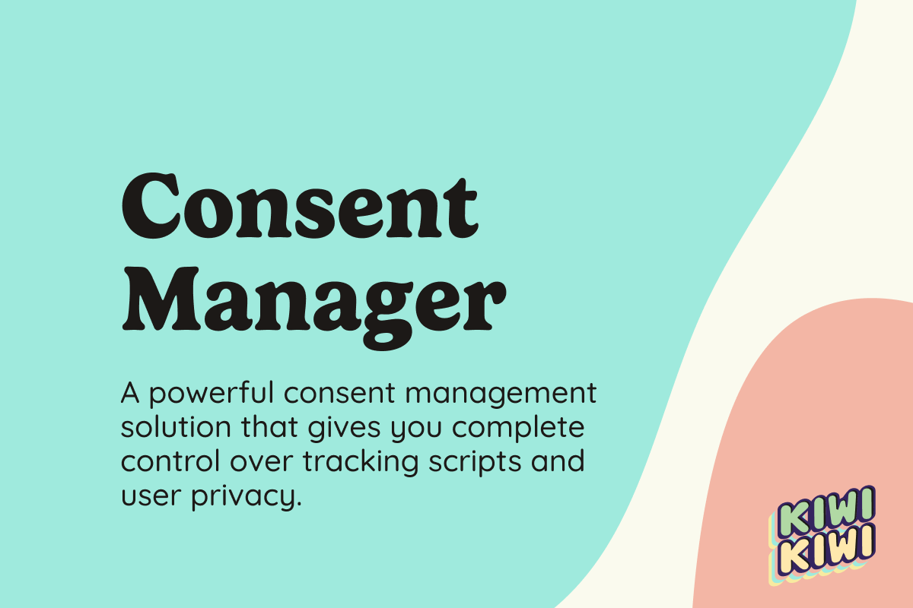
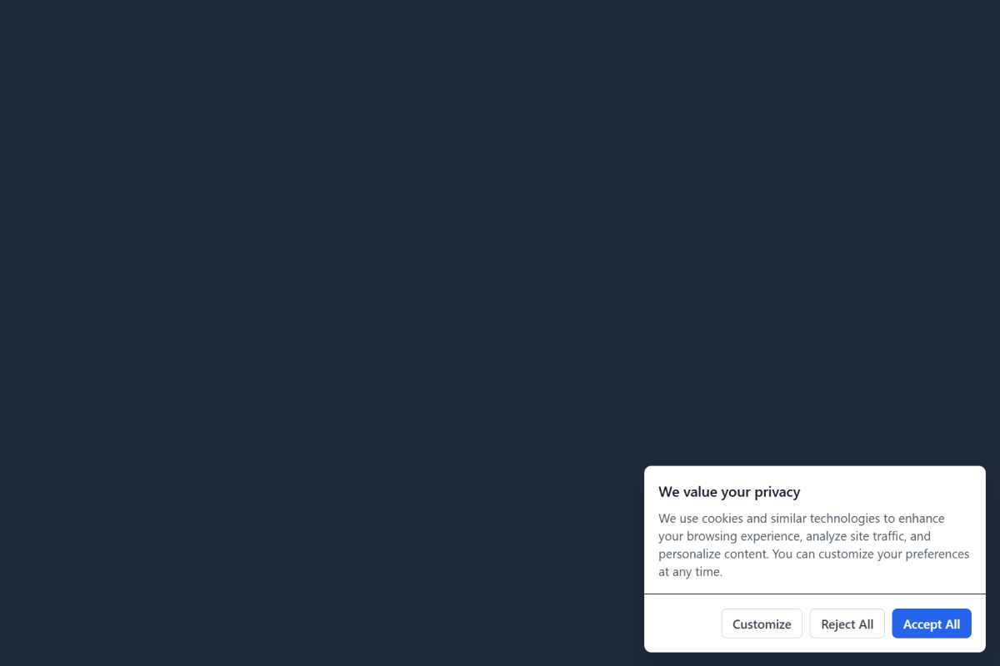
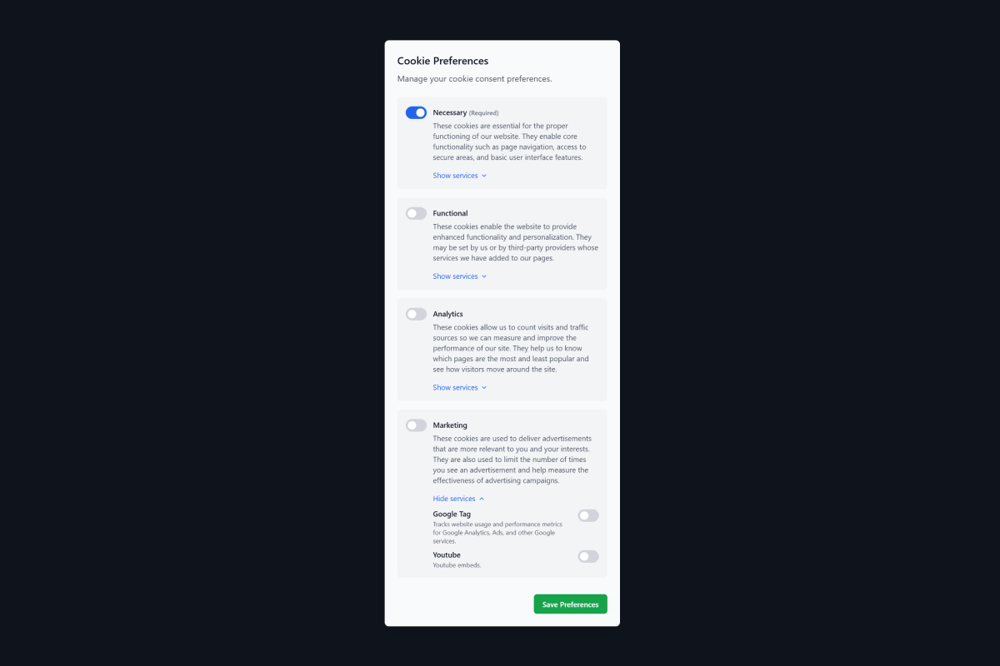
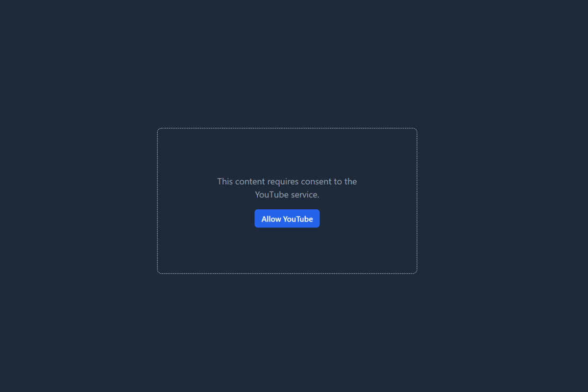
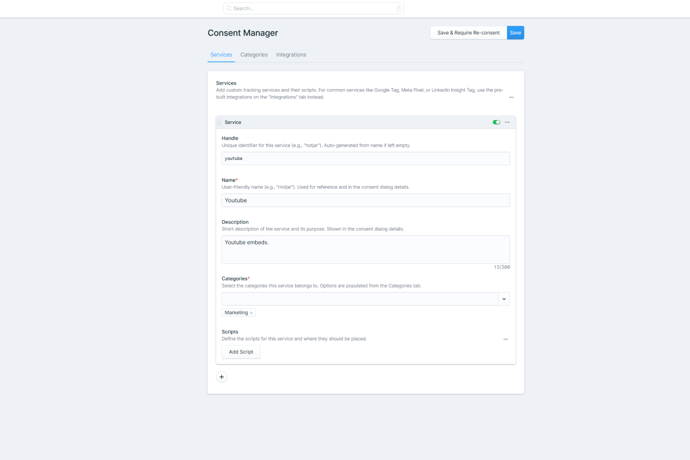
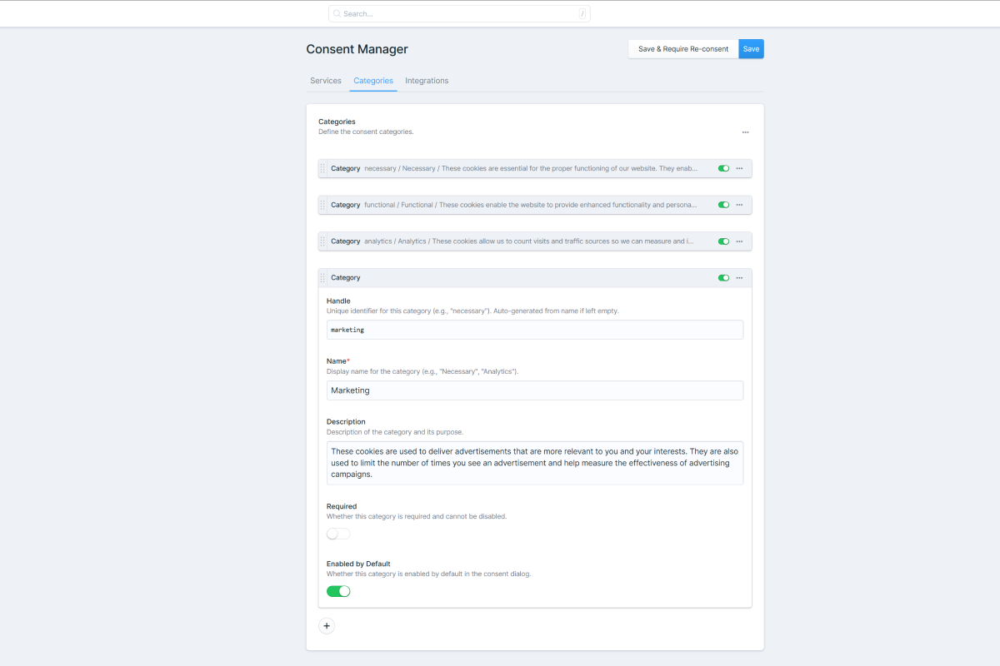
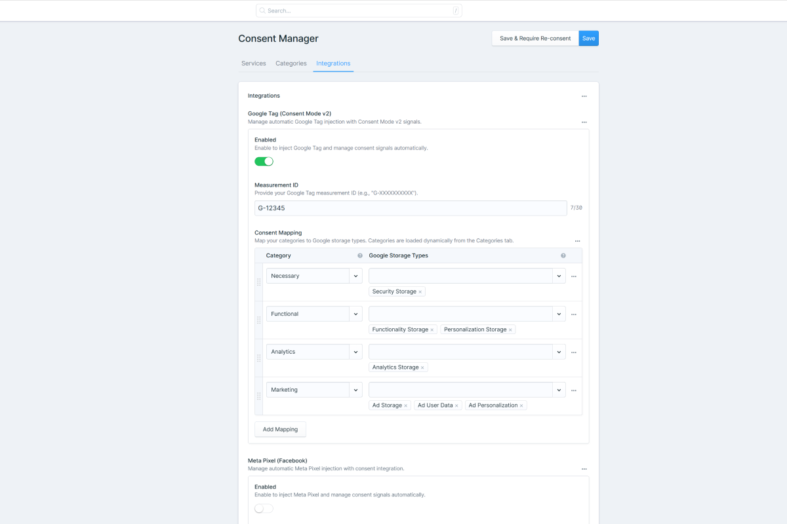

<p align="center">
    
</p>

# Statamic Consent Manager

A powerful, GDPR-compliant consent management solution ("cookie banner") for Statamic CMS that gives you complete control over tracking scripts and user privacy.

[Features](#features) • [Installation](#installation) • [Quick Start](#quick-start) • [Documentation](#documentation) • [Support](#support)

## Why Statamic Consent Manager?

Most cookie banner solutions are either too simple (just a "we use cookies" message) or too complex (expensive third-party SaaS platforms). **Statamic Consent Manager** is the perfect middle ground:

- **Native to Statamic**: Managed entirely within your Statamic Control Panel.
- **Privacy First**: Scripts are blocked by default until explicit consent is given.
- **Developer Friendly**: Built with Antlers and Tailwind, making it easy to style and extend.
- **Compliance Made Easy**: Built-in support for Google Consent Mode v2 and other major platforms.

[](https://statamic.com) [](LICENSE.md)

<p align="center">
    <a href="docs/screenshot-1.png"></a>
    <a href="docs/screenshot-2.png"></a>
    <a href="docs/screenshot-3.png"></a>
    <br>
    <a href="docs/screenshot-4.png"></a>
    <a href="docs/screenshot-5.png"></a>
    <a href="docs/screenshot-6.png"></a>
</p>

## Requirements

- **PHP** 8.2 or higher
- **Statamic** 5.0 or higher

## Features

### Powerful & Flexible
- **Service-level Consent** - Users consent to individual services, organized into logical categories (Analytics, Marketing, etc.)
- **Built-in Integrations** - Google Tag (gtag.js) with Consent Mode v2, Meta Pixel, and LinkedIn Insight Tag ready out of the box
- **Custom Script Support** - Add any third-party script with conditional loading based on consent
- **Control Panel Management** - Manage categories, services, and tracking scripts without touching code
- **Conditional Content** - Show placeholders for YouTube embeds, Google Maps, and other content requiring consent
- **Smart Cookie Management** - Automatically stores and respects user preferences for 180 days (configurable)
- **Permission-based Access** - Control Panel access restricted by Statamic permissions

### Fully Customizable
- **Publishable Views** - Complete control over dialog markup and styling using Antlers templates
- **Native Dialog Elements** - Built on semantic HTML `<dialog>` elements for accessibility
- **Tailwind CSS Out of the Box** - Pre-styled dialogs you can fully customize or replace
- **Multi-language Support** - Translate all text via Laravel's translation files
- **Flexible Script Placement** - Load scripts in `<head>` or before `</body>`
- **Configurable Settings** - Customize cookie name, duration, and behavior via config file

### Developer Experience
- **Simple JavaScript API** - Easy-to-use methods for checking consent and triggering dialogs
- **Debug Mode** - Built-in console logging tied to Laravel's `APP_DEBUG`
- **Live Preview Control** - Optionally disable in Statamic's Live Preview mode
- **Zero Dependencies** - Lightweight vanilla JavaScript, no frameworks required

### Compliance Ready
- **GDPR Compliant** - Respects user privacy choices before loading tracking scripts
- **Consent Versioning** - Require re-consent when you make significant changes to your privacy policy
- **Required Categories** - Mark essential functionality as required (e.g., security, functionality)
- **Granular Control** - Per-service consent for maximum transparency
- **Revocation Support** - Users can withdraw consent at any time with automatic page reload

## Installation

This is a commercial addon. [Purchase a license on the Statamic Marketplace →](https://statamic.com/addons/kiwikiwi/consent-manager)

```bash
composer require eminos/statamic-consent-manager
```

That's it! The addon automatically publishes its assets during installation.

## Quick Start

1. **Add tags to your layout:**

```antlers
<head>
    {{ consent_manager:head }}
</head>
<body>
    {{ consent_manager:dialog }}
    {{ consent_manager:body }}
</body>
```

2. **Configure in Control Panel:**
   - Navigate to **Tools > Consent Manager**
   - Add your tracking services and scripts
   - Enable built-in integrations (Google Tag, Meta Pixel, etc.)

3. **Done!** Your consent dialogs are live.

## Documentation

Complete documentation is available in [DOCUMENTATION.md](DOCUMENTATION.md):

- [Installation & Setup](DOCUMENTATION.md#installation)
- [Configuration Options](DOCUMENTATION.md#configuration)
- [Control Panel Guide](DOCUMENTATION.md#control-panel-setup)
- [Usage Examples](DOCUMENTATION.md#usage)
- [API Reference](DOCUMENTATION.md#api-reference)
- [Customization Guide](DOCUMENTATION.md#customization)

## Built-in Integrations

### Google Tag (Consent Mode v2)
Complete integration with Google's Consent Mode v2, automatically mapping your consent categories to Google's storage types.

### Meta Pixel
Manage Facebook Pixel consent with automatic grant/revoke handling.

### LinkedIn Insight Tag
Track conversions and audience building with proper consent management.

## Support

For support, questions, or feature requests, please open an issue on this GitHub repository.

## License

This is a commercial addon that requires a license for production use.

[Purchase a license on the Statamic Marketplace →](https://statamic.com/addons/kiwikiwi/consent-manager)

See [LICENSE.md](LICENSE.md) for full license terms.

Copyright © 2025 Emin Jasarevic

---

Made by [kiwikiwi](https://kiwikiwi.se) for the Statamic community
